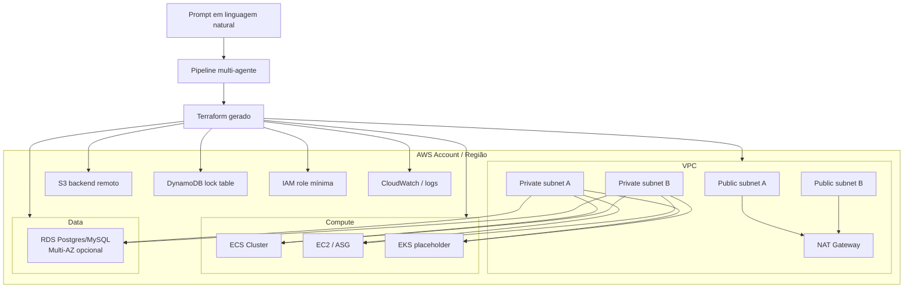
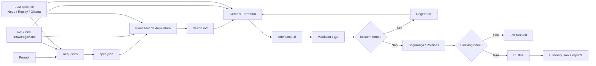

# AI Agents for AWS Terraform Generation

Plataforma de geração de Infrastructure as Code (Terraform) para AWS baseada em pipeline multi-agente.

A aplicação recebe um prompt em linguagem natural, transforma-o numa `spec.json` estruturada, gera artefactos Terraform (`main.tf`, `variables.tf`, `outputs.tf`, `providers.tf`, `backend.tf`) e executa validações/políticas para entregar um resultado auditável (`summary.json` + relatórios).

Inclui um RAG local (baseado em ficheiros Markdown em `infra_agents/knowledge/`) para melhorar consistência técnica nos agentes de `Requisitos`, `Planeador` e `Gerador`.
Também inclui uma camada opcional de geração estruturada por LLM (`infra_agents/llm/`) preparada para fine-tuning incremental.

O projeto suporta dois motores de orquestração:
- `classic`: fluxo determinístico implementado em Python puro
- `langgraph`: fluxo em grafo de estados com LangGraph/LangChain

Por defeito (`engine=auto`), usa `langgraph` quando a dependência está instalada; caso contrário usa `classic`.

## Objetivo

Este projeto implementa um MVP de orquestração por agentes para:
- converter prompt em `spec.json` estruturado
- gerar design e código Terraform AWS
- validar com ferramentas reais (quando disponíveis)
- aplicar políticas de segurança
- produzir resumo final do job e relatórios

## Diagrama da infraestrutura



## Arquitetura dos agentes

Ordem de execução no supervisor:
1. `Requisitos`
2. `Planeador de Arquitetura`
3. `Gerador Terraform`
4. `Validador/QA`
5. `Segurança/Políticas`
6. `Custos`

O supervisor faz loop controlado de correção (`max_iterations`) entre geração e validação.

## Diagrama do workflow



## AWS Scope do scaffold

O scaffold está adaptado para AWS com:
- provider `hashicorp/aws` (`~> 5.0`)
- backend remoto `s3` + lock `dynamodb` (`backend.hcl.example`)
- verificação opcional de conta AWS (`expected_account_id`)
- VPC com subnets públicas/privadas e NAT
- IAM role mínima por runtime (`ecs`, `eks`, `ec2`)
- recursos de compute base:
  - `ecs`: cluster com Container Insights
  - `ec2`: launch template + autoscaling group (quando `autoscaling=true`)
  - `eks`: placeholder controlado para extensão na próxima iteração
- RDS com `manage_master_user_password = true` (sem password hardcoded)
- outputs principais de conta/região/rede/iam/database

## RAG local

- Fonte de conhecimento: `infra_agents/knowledge/*.md`
- Retriever lexical local: `infra_agents/rag.py`
- Agentes que usam RAG: `requirements`, `planner`, `generator`
- Transparência por job:
  - `reports/rag_requirements.md`
  - `reports/rag_planner.md`
  - `reports/rag_generator.md`
  - `summary.json` inclui `history` com `metadata.rag_sources`

## Estrutura

- `infra_agents/contracts.py`: contrato entre agentes e validação da spec
- `infra_agents/orchestrator.py`: facade de seleção de engine
- `infra_agents/orchestration/`: implementações `classic` e `langgraph`
- `infra_agents/agents/`: agentes (`requirements`, `planner`, `generator`, `validator`, `security`, `cost`)
- `infra_agents/llm/`: interface LLM, factory por ambiente e replay backend
- `infra_agents/tools/`: wrappers para filesystem e comandos CLI
- `infra_agents/knowledge/`: base local de referências/padrões
- `examples/prompt.txt`: prompt de exemplo
- `scripts/export_finetune_dataset.py`: exporta dataset JSONL a partir de jobs concluídos
- `scripts/evaluate_requirements_agent.py`: avaliação offline do agente de requisitos
- `datasets/README.md`: formato de dataset e fluxo de treino/avaliação
- `tests/`: testes unitários e de pipeline

## Pré-requisitos

- Python `>= 3.11`
- Terraform CLI (opcional mas recomendado)
- Ferramentas opcionais de validação/custo:
  - `tflint`
  - `checkov`
  - `tfsec`
  - `infracost`
- Dependências opcionais para engine LangGraph:
  - `langgraph`
  - `langchain-core`

Se as ferramentas não estiverem instaladas, o pipeline continua e regista `warning` no relatório.

## Instalação

```bash
python -m venv .venv
source .venv/bin/activate
pip install -e .
```

Para ativar orquestração com LangGraph:

```bash
pip install -e .[langgraph]
```

## Execução via CLI

Com prompt em ficheiro:

```bash
python -m infra_agents.cli --prompt-file examples/prompt.txt
```

Com prompt inline:

```bash
python -m infra_agents.cli --prompt "AWS prod em eu-west-1 com ECS e RDS postgres"
```

Comandos via entrypoints:

```bash
infra-agents --prompt-file examples/prompt.txt
```

Parâmetros úteis:
- `--output-dir` (default: `jobs`)
- `--max-iterations` (default: `3`)
- `--execution-mode` (atual: apenas `plan-only`)
- `--engine` (`auto`, `classic`, `langgraph`)
- `--validation-mode` (`auto`, `credentialless`)

Modo `auto`:
- executa `terraform fmt`, `terraform init -backend=false`, `terraform validate`
- tenta ainda `terraform plan` num workspace temporário local, sem `backend.tf`
- reutiliza `.terraform` e `.terraform.lock.hcl` quando disponíveis para acelerar a validação
- erros de ambiente como falta de profile AWS/credenciais são tratados como `warning`

Modo `credentialless`:
- executa `terraform fmt`, `terraform init -backend=false` e `terraform validate`
- regista `terraform plan` como `skipped` no relatório de validação
- serve para validar coerência estrutural do Terraform sem depender de credenciais AWS locais

## Fine-Tuning Readiness

Esta implementação separa claramente:
- lógica determinística crítica (validação, segurança, policy gates)
- decisões de geração estruturada (onde fine-tuning pode ajudar)

O fine-tuning deve atuar apenas nos hooks LLM dos agentes abaixo:
- `RequirementsAgent` -> tarefa `requirements_spec_v1`
- `ArchitecturePlannerAgent` -> tarefa `planner_design_v1`
- `TerraformGeneratorAgent` -> tarefa `generator_overrides_v1`

### Fluxo completo recomendado

### 1) Gerar dados de treino a partir de jobs reais

Executa o pipeline em cenários reais e exporta dataset:

```bash
python scripts/export_finetune_dataset.py --jobs-dir jobs --output datasets/finetune_train.jsonl
```

O export cria exemplos JSONL com:
- `task`
- `input` (prompt + contexto útil)
- `output` (label estruturada)

### 2) Curar dados antes do treino

Antes de treinar, valida manualmente:
- remover prompts com ambiguidades mal resolvidas
- remover labels incorretas ou inconsistentes
- garantir distribuição por `env` (`dev/staging/prod`), `region`, `compute.type`, `data.engine`
- garantir que não há segredos nem dados sensíveis

Recomendação prática:
- manter 10%-20% dos exemplos para validação (`finetune_val.jsonl`)
- não misturar exemplos de baixa qualidade na fase inicial

### 3) Definir objetivo por tarefa (não treinar “tudo junto” sem controlo)

Objetivo por task:
- `requirements_spec_v1`: melhorar parsing de prompt -> spec
- `planner_design_v1`: melhorar seleção de módulos/notas mantendo allowlist
- `generator_overrides_v1`: apenas recomendações de `tfvars_overrides` permitidos

Importante:
- guardrails de segurança continuam determinísticos
- fine-tuning não substitui `terraform validate`, `tflint`, `checkov`, `tfsec`

### 4) Medir baseline antes de treinar

Hoje já existe avaliação offline para `requirements_spec_v1`:

```bash
python scripts/evaluate_requirements_agent.py --dataset datasets/finetune_train.jsonl
```

Guarda estas métricas como baseline para comparar com modelo fine-tuned.

### 5) Treinar modelo externamente

O treino é feito fora deste repositório (na plataforma/model provider da tua escolha), usando o JSONL exportado.

Quando tiveres um modelo treinado:
- mantém output estritamente estruturado por tarefa
- evita permitir texto livre sem schema
- versiona modelo e dataset (ex: `model_v1`, `dataset_2026-03-01`)

### 6) Integrar sem risco (rollout controlado)

No runtime atual, os agentes usam por defeito `NoopLLM` (modo determinístico).

Para simular modelo fine-tuned localmente, usa replay:

```bash
export INFRA_AGENTS_LLM_MODE=replay
export INFRA_AGENTS_LLM_REPLAY_FILE=datasets/finetune_train.jsonl
python -m infra_agents.cli --prompt-file examples/prompt.txt --engine classic
```

Para activar o modelo local no Ollama:

```bash
export INFRA_AGENTS_LLM_MODE=ollama
export INFRA_AGENTS_LLM_BASE_URL=http://localhost:11434
export INFRA_AGENTS_LLM_MODEL=llama3.2:latest
export INFRA_AGENTS_LLM_TEMPERATURE=0
python -m infra_agents.cli --prompt-file examples/prompt.txt --engine classic
```

Variáveis suportadas no modo `ollama`:
- `INFRA_AGENTS_LLM_BASE_URL`
- `INFRA_AGENTS_LLM_MODEL`
- `INFRA_AGENTS_LLM_TIMEOUT` (default `60`)
- `INFRA_AGENTS_LLM_TEMPERATURE` (default `0`)

O provider envia o schema JSON de cada tarefa ao Ollama e exige resposta em JSON puro, mantendo a mesma interface:
- `generate_structured(request: LLMRequest) -> dict | None`

Agentes que usam LLM/Ollama no runtime atual:
- `RequirementsAgent`
- `ArchitecturePlannerAgent`
- `TerraformGeneratorAgent`

Agentes que continuam determinísticos e não usam LLM/Ollama:
- `ValidatorAgent`
- `SecurityPolicyAgent`
- `CostAgent`

Nota operacional:
- mesmo nos agentes acima, o Ollama só é usado quando `INFRA_AGENTS_LLM_MODE=ollama`
- se o modelo falhar ou devolver JSON inválido, o pipeline faz fallback para a lógica determinística
- `RequirementsAgent` rejeita specs do LLM inválidas ou inconsistentes com os campos críticos do prompt
- `ArchitecturePlannerAgent` só aceita módulos LLM compatíveis com o runtime pedido
- `TerraformGeneratorAgent` só aplica overrides permitidos e contextualizados ao workload
- o estado por execução fica visível em `summary.json` através de `history[].metadata.llm_used`

### 7) Validar pós-rollout

Após integrar modelo real:
- correr testes do repositório
- executar pipeline em prompts de regressão
- comparar métricas com baseline
- inspecionar `summary.json` (`history[].metadata.llm_used`, `rag_sources`, `tfvars_overrides`)

### 8) Estratégia de rollback

Se houver regressão, desativa LLM imediatamente:
- remover/alterar variáveis de ambiente para modo default (`NoopLLM`)
- voltar ao fluxo determinístico sem interromper guardrails

Isto permite experimentar fine-tuning com baixo risco operacional.

## Execução via API

Iniciar API local:

```bash
python -m infra_agents.api
```

Criar job:

```bash
curl -X POST http://127.0.0.1:8080/jobs \
  -H 'content-type: application/json' \
  -d '{"prompt":"AWS prod eu-west-1 com ECS e RDS"}'
```

A resposta inclui `job_id`, `status`, `workspace`, `summary_file` e `engine`.

## Outputs do job

Cada execução cria `jobs/<job_id>/` com artefactos como:
- `spec.json`
- `design.md`
- `main.tf`, `variables.tf`, `outputs.tf`, `providers.tf`, `versions.tf`
- `backend.tf`, `backend.hcl.example`, `terraform.tfvars`
- `reports/validation.json`
- `reports/security.json`
- `reports/cost.json`
- `summary.json`

## Guardrails implementados

- allowlist de provider: apenas `aws`
- backend remoto obrigatório com `s3`
- verificação de configuração de lock DynamoDB no backend example
- execução em `plan-only`
- validação `auto` com `terraform plan` local sem backend remoto
- validação `credentialless` para coerência estrutural sem credenciais AWS
- deteção de padrões inseguros:
  - acesso público explícito
  - credenciais hardcoded
  - encriptação desativada
  - IMDSv2 opcional (bloqueado)

## Estados possíveis do job

- `validated`: validação concluída sem erros bloqueantes
- `blocked`: bloqueado por políticas de segurança (severity `critical`)
- `failed`: erros de validação após esgotar iterações
- `done`: finalizado sem necessidade de validação adicional

## Testes

```bash
python -m unittest discover -s tests -p 'test_*.py' -v
```

## Limitações atuais (MVP)

- EKS ainda está como placeholder de integração
- em modo `auto`, `terraform plan` continua a depender de provider/plugins e de credenciais/profile AWS válidos
- em modo `credentialless`, não há `terraform plan`; valida apenas coerência estrutural local
- não executa `terraform apply`
- não integra OPA/Conftest nem catálogo interno de módulos ainda
