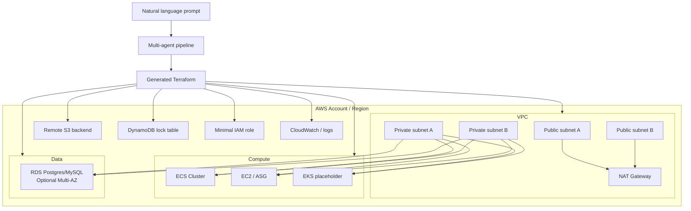
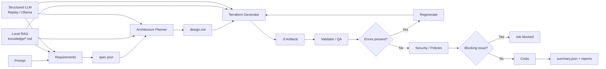

# AI Agents for AWS Terraform Generation

Infrastructure as Code (Terraform) generation platform for AWS based on a multi-agent pipeline.

The application receives a natural language prompt, transforms it into a structured `spec.json`, generates Terraform artifacts (`main.tf`, `variables.tf`, `outputs.tf`, `providers.tf`, `backend.tf`) and runs validations/policies to deliver an auditable result (`summary.json` + reports).

It includes a local RAG (based on Markdown files in `infra_agents/knowledge/`) to improve technical consistency across the `Requirements`, `Planner`, and `Generator` agents.
It also includes a structured LLM generation layer (`infra_agents/llm/`), with support for local `Ollama` by default and `replay` for offline evaluation and incremental fine-tuning.

The project supports two orchestration engines:
- `classic`: supervisor implemented in pure Python
- `langgraph`: state-graph flow with LangGraph/LangChain

By default (`engine=auto`), it uses `langgraph` when the dependency is installed; otherwise it uses `classic`.

## Purpose

This project implements an agent-orchestration MVP to:
- convert a prompt into a structured `spec.json`
- generate AWS Terraform design and code
- validate with real tools (when available)
- apply security policies
- produce a final job summary and reports

## Infrastructure diagram



## Agent architecture

Execution order in the supervisor:
1. `Requirements`
2. `Architecture Planner`
3. `Terraform Generator`
4. `Validator/QA`
5. `Security/Policies`
6. `Costs`

The supervisor runs a controlled correction loop (`max_iterations`) between generation and validation.

## Workflow diagram



## AWS Scope of the scaffold

The scaffold is adapted for AWS with:
- `hashicorp/aws` provider (`~> 5.0`)
- remote `s3` backend + `dynamodb` lock (`backend.hcl.example`)
- optional AWS account verification (`expected_account_id`)
- VPC with public/private subnets, NAT, and VPC Flow Logs
- dedicated KMS key for logs/observability when `log_kms_key_id` is not provided
- minimal IAM role per runtime (`ecs`, `eks`, `ec2`) with separation between task role and execution role in the case of ECS
- base compute resources:
  - `ecs`: cluster with Container Insights + `task_definition` + Fargate `service`
  - `ec2`: launch template + autoscaling group (when `autoscaling=true`)
  - `eks`: controlled placeholder for extension in the next iteration
- RDS with `manage_master_user_password = true`, IAM auth, enhanced monitoring, and Performance Insights with KMS
- main account/region/network/iam/database outputs

## Local RAG

- Knowledge source: `infra_agents/knowledge/*.md`
- Local lexical retriever: `infra_agents/rag.py`
- Agents that use RAG: `requirements`, `planner`, `generator`
- Per-job transparency:
  - `reports/rag_requirements.md`
  - `reports/rag_planner.md`
  - `reports/rag_generator.md`
  - `summary.json` includes `history` with `metadata.rag_sources`

## Structure

- `infra_agents/contracts.py`: contract between agents and spec validation
- `infra_agents/orchestrator.py`: engine selection facade
- `infra_agents/orchestration/`: `classic` and `langgraph` implementations
- `infra_agents/agents/`: agents (`requirements`, `planner`, `generator`, `validator`, `security`, `cost`)
- `infra_agents/llm/`: LLM interface, Ollama integration, environment-based factory, and replay backend
- `infra_agents/tools/`: wrappers for filesystem and CLI commands
- `infra_agents/knowledge/`: local base of references/patterns
- `examples/prompt.txt`: example prompt
- `scripts/export_finetune_dataset.py`: exports a JSONL dataset from completed jobs
- `scripts/evaluate_requirements_agent.py`: offline evaluation of the requirements agent
- `datasets/README.md`: dataset format and training/evaluation flow
- `tests/`: unit and pipeline tests

## Prerequisites

- Python `>= 3.11`
- Terraform CLI (optional but recommended)
- Optional validation/cost tools:
  - `tflint`
  - `checkov`
  - `trivy`
  - `infracost`
- `tfsec` is supported only as a fallback when `trivy` is not installed
- Optional dependencies for the LangGraph engine:
  - `langgraph`
  - `langchain-core`

If the tools are not installed, the pipeline continues and logs a `warning` in the report.

## Installation

```bash
python -m venv .venv
source .venv/bin/activate
pip install -e .
```

Validation/cost tools on macOS with Homebrew:

```bash
brew install tflint checkov trivy infracost
```

To enable orchestration with LangGraph:

```bash
pip install -e .[langgraph]
```

## Running via CLI

With a prompt file:

```bash
python -m infra_agents.cli --prompt-file examples/prompt.txt
```

This command has been successfully validated in the project's current state using local Ollama by default.
Operational prerequisite: the Ollama daemon must be accessible at `http://localhost:11434` and have the `llama3.2:latest` model available.

With an inline prompt:

```bash
python -m infra_agents.cli --prompt "AWS prod in eu-west-1 with ECS and RDS postgres"
```

Commands via entrypoints:

```bash
infra-agents --prompt-file examples/prompt.txt
```

Useful parameters:
- `--output-dir` (default: `jobs`)
- `--max-iterations` (default: `3`)
- `--execution-mode` (current: `plan-only` only)
- `--engine` (`auto`, `classic`, `langgraph`)
- `--validation-mode` (`auto`, `credentialless`)

`auto` mode:
- runs `terraform fmt`, `terraform init -backend=false`, `terraform validate`
- also attempts `terraform plan` in a local temporary workspace, without `backend.tf`
- reuses `.terraform` and `.terraform.lock.hcl` when available to speed up validation
- runs local scanners:
  - `tflint --init`
  - `tflint`
  - `checkov -d . --download-external-modules true --skip-path .external_modules`
  - `trivy config ... --skip-dirs .external_modules` when available, or `tfsec .` as a fallback
- environment errors such as missing AWS profile/credentials are treated as `warning`

`credentialless` mode:
- runs `terraform fmt`, `terraform init -backend=false`, and `terraform validate`
- logs `terraform plan` as `skipped` in the validation report
- used to validate the structural coherence of the Terraform without depending on local AWS credentials

## Fine-Tuning Readiness

This implementation clearly separates:
- rule-based guardrails and validations (`terraform validate`, scanners, policy gates)
- LLM-based structured generation decisions (where fine-tuning can help)

Fine-tuning should act only on the LLM hooks of the agents below:
- `RequirementsAgent` -> task `requirements_spec_v1`
- `ArchitecturePlannerAgent` -> task `planner_design_v1`
- `TerraformGeneratorAgent` -> task `generator_overrides_v1`

### Recommended full flow

### 1) Generate training data from real jobs

Run the pipeline on real scenarios and export the dataset:

```bash
python scripts/export_finetune_dataset.py --jobs-dir jobs --output datasets/finetune_train.jsonl
```

The export creates JSONL examples with:
- `task`
- `input` (prompt + useful context)
- `output` (structured label)

### 2) Curate data before training

Before training, manually validate:
- remove prompts with poorly resolved ambiguities
- remove incorrect or inconsistent labels
- ensure distribution across `env` (`dev/staging/prod`), `region`, `compute.type`, `data.engine`
- ensure there are no secrets or sensitive data

Practical recommendation:
- keep 10%-20% of the examples for validation (`finetune_val.jsonl`)
- do not mix low-quality examples in the initial phase

### 3) Define an objective per task (do not train "everything together" without control)

Objective per task:
- `requirements_spec_v1`: improve prompt -> spec parsing
- `planner_design_v1`: improve module/notes selection while keeping the allowlist
- `generator_overrides_v1`: only allowed `tfvars_overrides` recommendations

Important:
- security guardrails remain rule-based
- fine-tuning does not replace `terraform validate`, `tflint`, `checkov`, and `trivy`

### 4) Measure a baseline before training

There is already offline evaluation for `requirements_spec_v1`:

```bash
python scripts/evaluate_requirements_agent.py --dataset datasets/finetune_train.jsonl
```

Save these metrics as a baseline to compare against the fine-tuned model.

### 5) Train the model externally

Training is done outside this repository (on the platform/model provider of your choice), using the exported JSONL.

Once you have a trained model:
- keep output strictly structured per task
- avoid allowing free text without a schema
- version the model and dataset (e.g., `model_v1`, `dataset_2026-03-01`)

### 6) Integrate without risk (controlled rollout)

In the current runtime, agents use local Ollama by default at `http://localhost:11434` with the `llama3.2:latest` model.
If the service is unavailable, if the model fails, or if it returns invalid JSON, execution fails explicitly.

To simulate a fine-tuned model locally, use replay:

```bash
export INFRA_AGENTS_LLM_MODE=replay
export INFRA_AGENTS_LLM_REPLAY_FILE=datasets/finetune_train.jsonl
python -m infra_agents.cli --prompt-file examples/prompt.txt --engine classic
```

To make the default Ollama configuration explicit:

```bash
export INFRA_AGENTS_LLM_MODE=ollama
export INFRA_AGENTS_LLM_BASE_URL=http://localhost:11434
export INFRA_AGENTS_LLM_MODEL=llama3.2:latest
export INFRA_AGENTS_LLM_TEMPERATURE=0
python -m infra_agents.cli --prompt-file examples/prompt.txt --engine classic
```

Supported variables in `ollama` mode:
- `INFRA_AGENTS_LLM_BASE_URL`
- `INFRA_AGENTS_LLM_MODEL`
- `INFRA_AGENTS_LLM_TIMEOUT` (default `60`)
- `INFRA_AGENTS_LLM_TEMPERATURE` (default `0`)

The provider sends each task's JSON schema to Ollama and requires a pure JSON response, keeping the same interface:
- `generate_structured(request: LLMRequest) -> dict`

Agents that use LLM/Ollama in the current runtime:
- `RequirementsAgent`
- `ArchitecturePlannerAgent`
- `TerraformGeneratorAgent`

Agents that do not use LLM/Ollama:
- `ValidatorAgent`
- `SecurityPolicyAgent`
- `CostAgent`

Operational note:
- Ollama is the default mode when `INFRA_AGENTS_LLM_MODE` is not set
- if the model fails or returns invalid JSON, the pipeline terminates with an error
- `RequirementsAgent` rejects LLM specs that are invalid or inconsistent with the prompt's critical fields
- `RequirementsAgent` normalizes partial LLM payloads with valid defaults, including minimal subnet topology
- `ArchitecturePlannerAgent` only accepts LLM modules compatible with the requested runtime
- `TerraformGeneratorAgent` only applies overrides that are allowed and contextualized to the workload
- per-run state is visible in `summary.json` via `history[].metadata.llm_used`

### 7) Validate post-rollout

After integrating the real model:
- run the repository's tests
- run the pipeline on regression prompts
- compare metrics against the baseline
- inspect `summary.json` (`history[].metadata.llm_used`, `rag_sources`, `tfvars_overrides`)

### 8) Rollback strategy

If there is a regression:
- fix the Ollama configuration or temporarily switch to `INFRA_AGENTS_LLM_MODE=replay`
- validate the suite again before returning to live mode

This keeps the pipeline always dependent on structured model generation.

## Running via API

Start local API:

```bash
python -m infra_agents.api
```

Create a job:

```bash
curl -X POST http://127.0.0.1:8080/jobs \
  -H 'content-type: application/json' \
  -d '{"prompt":"AWS prod eu-west-1 with ECS and RDS"}'
```

The response includes `job_id`, `status`, `workspace`, `summary_file`, and `engine`.

## Job outputs

Each run creates `jobs/<job_id>/` with artifacts such as:
- `spec.json`
- `design.md`
- `main.tf`, `variables.tf`, `outputs.tf`, `providers.tf`, `versions.tf`
- `backend.tf`, `backend.hcl.example`, `terraform.tfvars`
- `reports/validation.json`
- `reports/security.json`
- `reports/cost.json`
- `reports/infracost.json` (when `infracost` is configured)
- `summary.json`

## Implemented guardrails

- provider allowlist: `aws` only
- mandatory remote backend with `s3`
- DynamoDB lock configuration check in the backend example
- `plan-only` execution
- `auto` validation with local `terraform plan` without a remote backend
- `credentialless` validation for structural coherence without AWS credentials
- IaC scanning with `checkov` and `trivy` (or `tfsec` as a fallback)
- exclusion of `.external_modules` from the scan to avoid noise from downloaded modules' internal examples
- detection of insecure patterns:
  - explicit public access
  - hardcoded credentials
  - disabled encryption
  - optional IMDSv2 (blocked)
- hardening of the generated scaffold:
  - CloudWatch Log Group with 365-day retention and KMS
  - active VPC Flow Logs
  - ECS with `readonlyRootFilesystem = true`
  - separate roles for ECS execution and runtime
  - RDS with `iam_database_authentication_enabled = true`
  - RDS with `auto_minor_version_upgrade = true`
  - RDS with enhanced monitoring and Performance Insights on KMS
  - security group with egress restricted to internal HTTPS/S3 prefix list

## Possible job states

- `validated`: validation completed with no blocking errors
- `blocked`: blocked by security policies (severity `critical`)
- `failed`: validation errors after exhausting iterations
- `done`: finished with no additional validation needed

## Tests

```bash
python -m pytest
```

## Current limitations (MVP)

- EKS is still an integration placeholder
- in `auto` mode, `terraform plan` still depends on the provider/plugins and valid AWS credentials/profile
- in `credentialless` mode, there is no `terraform plan`; it validates only local structural coherence
- the cost step falls back to a heuristic when `infracost` has no `INFRACOST_API_KEY` or `~/.config/infracost/credentials.yml`
- scanners may continue reporting real findings from the generated Terraform; this is expected and part of the supervisor's correction loop
- does not run `terraform apply`
- does not yet integrate OPA/Conftest or an internal module catalog
