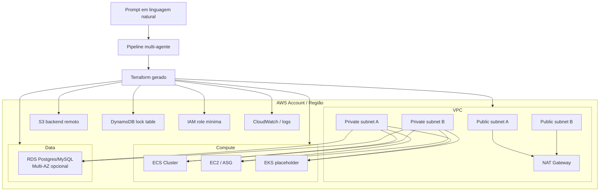
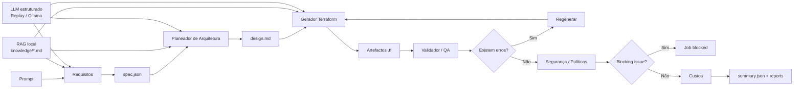
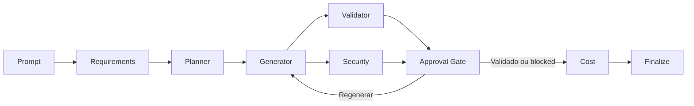

# AI Agents for AWS Terraform Generation

Plataforma de geração de Infrastructure as Code (Terraform) para AWS baseada em pipeline multi-agente.

A aplicação recebe um prompt em linguagem natural, transforma-o numa `spec.json` estruturada, gera artefactos Terraform (`main.tf`, `variables.tf`, `outputs.tf`, `providers.tf`, `backend.tf`) e executa validações/políticas para entregar um resultado auditável (`summary.json` + relatórios).

Inclui um RAG local (baseado em ficheiros Markdown em `infra_agents/knowledge/`) para melhorar consistência técnica nos agentes de `Requisitos`, `Planeador` e `Gerador`.
Inclui também uma camada de geração estruturada por LLM (`infra_agents/llm/`), com suporte a `Ollama` local por defeito e `replay` para avaliação offline e fine-tuning incremental.

O projeto suporta dois motores de orquestração:
- `classic`: supervisor implementado em Python puro, simples e estável
- `langgraph`: fluxo em grafo de estados com LangGraph, preparado para evolução stateful

Direção arquitetural atual (`project-v2.json`):
- `langgraph` é a trajetória principal de evolução da runtime
- `classic` mantém-se como fallback operacional durante a transição
- `langchain-core` entra como dependência técnica do ecossistema LangGraph, não como framework central do domínio
- LangChain só deve ser aprofundado quando existir uma necessidade clara de multi-provider, retrieval semântico ou tool-calling estruturado

No estado atual do código, `engine=auto` usa `langgraph` quando a dependência está instalada; caso contrário usa `classic`.

## Objetivo

Este projeto implementa um MVP de orquestração por agentes para:
- converter prompt em `spec.json` estruturado
- gerar design e código Terraform AWS
- validar com ferramentas reais (quando disponíveis)
- aplicar políticas de segurança
- produzir resumo final do job e relatórios

## Diagrama da infraestrutura



## Arquitetura dos agentes

Ordem de execução no supervisor:
1. `Requisitos`
2. `Planeador de Arquitetura`
3. `Gerador Terraform`
4. `Validador/QA`
5. `Segurança/Políticas`
6. `Custos`

O supervisor faz loop controlado de correção (`max_iterations`) entre geração e validação.

## Diagrama do workflow



## Estratégia V2

Com base na análise do projeto e no workflow definido em `project-v2.json`, a recomendação de adoção é:
- aprofundar `LangGraph` primeiro, porque o problema central é de orquestração stateful
- manter a camada LLM atual (`AgentLLM`) como fronteira interna estável
- adiar a adoção mais profunda de `LangChain` até haver uma necessidade comprovada

Isto significa que o objetivo não é reescrever os agentes de negócio com abstrações genéricas, mas sim evoluir a runtime para suportar:
- `checkpointing`
- `resume` de jobs
- `human-in-the-loop`
- paralelismo controlado
- retries por etapa
- melhor observabilidade por node

## Decisão sobre LangGraph e LangChain

### LangGraph

LangGraph é a escolha recomendada para a próxima fase do projeto porque encaixa diretamente na necessidade de:
- gerir estado de execução entre agentes
- modelar loops de regeneração com mais controlo
- introduzir interrupções para aprovação humana
- suportar branching e eventual execução paralela de validação e segurança
- acrescentar durabilidade operacional sem mudar o contrato funcional dos agentes

### LangChain

LangChain não é a abstração central recomendada para este projeto neste momento.

Uso recomendado, apenas quando necessário:
- adaptadores opcionais para múltiplos providers LLM
- structured output avançado quando a camada atual deixar de ser suficiente
- retrieval semântico, embeddings ou vector store quando o RAG lexical local deixar de escalar

Uso não recomendado neste estágio:
- substituir os agentes atuais por LangChain Agents genéricos
- espalhar tipos e contratos de LangChain por todo o core do projeto
- trocar o retriever local atual sem evidência de ganho mensurável

## Roadmap de adoção

O plano definido em `project-v2.json` organiza a evolução em cinco fases:

### P0. Baseline e preparação

- congelar o comportamento atual com testes de equivalência entre `classic` e `langgraph`
- tornar o contrato de estado do workflow mais explícito
- alinhar documentação e instalação com a estratégia de adoção

### P1. Aprofundar LangGraph

- adicionar `checkpointing` e `resume`
- modelar retries e timeouts por node
- criar pontos de `human-in-the-loop`
- introduzir paralelismo controlado entre validação e segurança
- separar subgraphs por fase de negócio

### P2. Observabilidade e auditoria

- enriquecer `summary.json` com telemetria por etapa
- adicionar tracing seguro de prompts e artefactos
- medir qualidade operacional por engine e por fase

### P3. Adoção seletiva de LangChain

- manter `AgentLLM` como fronteira interna
- introduzir LangChain apenas atrás de adaptadores opcionais
- avaliar retrieval mais sofisticado só quando houver dados e métricas que o justifiquem

### P4. Promoção para produção

- fazer rollout por feature flag
- reforçar testes de regressão específicos da runtime
- manter `classic` como fallback até LangGraph estar comprovadamente estável

## Workflow alvo da runtime

O workflow alvo da versão V2 passa a assumir `LangGraph` como engine principal evolutiva:



Pontos de interrupção previstos:
- após findings críticos
- após falhas repetidas de validação
- antes de futuras operações de `apply`

## AWS Scope do scaffold

O scaffold está adaptado para AWS com:
- provider `hashicorp/aws` (`~> 5.0`)
- backend remoto `s3` + lock `dynamodb` (`backend.hcl.example`)
- verificação opcional de conta AWS (`expected_account_id`)
- VPC com subnets públicas/privadas, NAT e VPC Flow Logs
- KMS key dedicada para logs/observability quando `log_kms_key_id` não é fornecido
- IAM role mínima por runtime (`ecs`, `eks`, `ec2`) com separação entre task role e execution role no caso de ECS
- recursos de compute base:
  - `ecs`: cluster com Container Insights + `task_definition` + `service` Fargate
  - `ec2`: launch template + autoscaling group (quando `autoscaling=true`)
  - `eks`: placeholder controlado para extensão na próxima iteração
- RDS com `manage_master_user_password = true`, IAM auth, enhanced monitoring e Performance Insights com KMS
- outputs principais de conta/região/rede/iam/database

## RAG local

- Fonte de conhecimento: `infra_agents/knowledge/*.md`
- Retriever lexical local: `infra_agents/rag.py`
- Agentes que usam RAG: `requirements`, `planner`, `generator`
- Transparência por job:
  - `reports/rag_requirements.md`
  - `reports/rag_planner.md`
  - `reports/rag_generator.md`
  - `summary.json` inclui `history` com `metadata.rag_sources`

## Estrutura

- `infra_agents/contracts.py`: contrato entre agentes e validação da spec
- `infra_agents/orchestrator.py`: facade de seleção de engine
- `infra_agents/orchestration/`: implementações `classic` e `langgraph`
- `infra_agents/agents/`: agentes (`requirements`, `planner`, `generator`, `validator`, `security`, `cost`)
- `infra_agents/llm/`: interface LLM, integração Ollama, factory por ambiente e replay backend
- `infra_agents/tools/`: wrappers para filesystem e comandos CLI
- `infra_agents/knowledge/`: base local de referências/padrões
- `examples/prompt.txt`: prompt de exemplo
- `scripts/export_finetune_dataset.py`: exporta dataset JSONL a partir de jobs concluídos
- `scripts/evaluate_requirements_agent.py`: avaliação offline do agente de requisitos
- `datasets/README.md`: formato de dataset e fluxo de treino/avaliação
- `tests/`: testes unitários e de pipeline

## Pré-requisitos

- Python `>= 3.11`
- Terraform CLI (opcional mas recomendado)
- Ferramentas opcionais de validação/custo:
  - `tflint`
  - `checkov`
  - `trivy`
  - `infracost`
- `tfsec` é suportado apenas como fallback quando `trivy` não está instalado
- Dependências opcionais para runtime LangGraph:
  - `langgraph`
  - `langchain-core`

Se as ferramentas não estiverem instaladas, o pipeline continua e regista `warning` no relatório.

## Instalação

```bash
python -m venv .venv
source .venv/bin/activate
pip install -e .
```

Ferramentas de validação/custo no macOS com Homebrew:

```bash
brew install tflint checkov trivy infracost
```

Para ativar a runtime com LangGraph:

```bash
pip install -e .[langgraph]
```

Nota de arquitetura:
- `langchain-core` é instalado aqui porque faz parte do ecossistema LangGraph adotado neste projeto
- isso não significa que o domínio da aplicação passe a depender de LangChain como abstração principal

## Execução via CLI

Com prompt em ficheiro:

```bash
python -m infra_agents.cli --prompt-file examples/prompt.txt
```

Este comando foi validado com sucesso no estado atual do projeto usando o Ollama local por defeito.
Pré-requisito operacional: o daemon do Ollama deve estar acessível em `http://localhost:11434` e ter o modelo `llama3.2:latest` disponível.

Com prompt inline:

```bash
python -m infra_agents.cli --prompt "AWS prod em eu-west-1 com ECS e RDS postgres"
```

Comandos via entrypoints:

```bash
infra-agents --prompt-file examples/prompt.txt
```

Parâmetros úteis:
- `--output-dir` (default: `jobs`)
- `--max-iterations` (default: `3`)
- `--execution-mode` (atual: apenas `plan-only`)
- `--engine` (`auto`, `classic`, `langgraph`)
- `--validation-mode` (`auto`, `credentialless`)

Modo `auto`:
- executa `terraform fmt`, `terraform init -backend=false`, `terraform validate`
- tenta ainda `terraform plan` num workspace temporário local, sem `backend.tf`
- reutiliza `.terraform` e `.terraform.lock.hcl` quando disponíveis para acelerar a validação
- executa scanners locais:
  - `tflint --init`
  - `tflint`
  - `checkov -d . --download-external-modules true --skip-path .external_modules`
  - `trivy config ... --skip-dirs .external_modules` quando disponível, ou `tfsec .` como fallback
- erros de ambiente como falta de profile AWS/credenciais são tratados como `warning`

Modo `credentialless`:
- executa `terraform fmt`, `terraform init -backend=false` e `terraform validate`
- regista `terraform plan` como `skipped` no relatório de validação
- serve para validar coerência estrutural do Terraform sem depender de credenciais AWS locais

## Fine-Tuning Readiness

Esta implementação separa claramente:
- guardrails e validações baseadas em regras (`terraform validate`, scanners, policy gates)
- decisões de geração estruturada por LLM (onde fine-tuning pode ajudar)

O fine-tuning deve atuar apenas nos hooks LLM dos agentes abaixo:
- `RequirementsAgent` -> tarefa `requirements_spec_v1`
- `ArchitecturePlannerAgent` -> tarefa `planner_design_v1`
- `TerraformGeneratorAgent` -> tarefa `generator_overrides_v1`

### Fluxo completo recomendado

### 1) Gerar dados de treino a partir de jobs reais

Executa o pipeline em cenários reais e exporta dataset:

```bash
python scripts/export_finetune_dataset.py --jobs-dir jobs --output datasets/finetune_train.jsonl
```

O export cria exemplos JSONL com:
- `task`
- `input` (prompt + contexto útil)
- `output` (label estruturada)

### 2) Curar dados antes do treino

Antes de treinar, valida manualmente:
- remover prompts com ambiguidades mal resolvidas
- remover labels incorretas ou inconsistentes
- garantir distribuição por `env` (`dev/staging/prod`), `region`, `compute.type`, `data.engine`
- garantir que não há segredos nem dados sensíveis

Recomendação prática:
- manter 10%-20% dos exemplos para validação (`finetune_val.jsonl`)
- não misturar exemplos de baixa qualidade na fase inicial

### 3) Definir objetivo por tarefa (não treinar “tudo junto” sem controlo)

Objetivo por task:
- `requirements_spec_v1`: melhorar parsing de prompt -> spec
- `planner_design_v1`: melhorar seleção de módulos/notas mantendo allowlist
- `generator_overrides_v1`: apenas recomendações de `tfvars_overrides` permitidos

Importante:
- guardrails de segurança continuam baseados em regras
- fine-tuning não substitui `terraform validate`, `tflint`, `checkov` e `trivy`

### 4) Medir baseline antes de treinar

Hoje já existe avaliação offline para `requirements_spec_v1`:

```bash
python scripts/evaluate_requirements_agent.py --dataset datasets/finetune_train.jsonl
```

Guarda estas métricas como baseline para comparar com modelo fine-tuned.

### 5) Treinar modelo externamente

O treino é feito fora deste repositório (na plataforma/model provider da tua escolha), usando o JSONL exportado.

Quando tiveres um modelo treinado:
- mantém output estritamente estruturado por tarefa
- evita permitir texto livre sem schema
- versiona modelo e dataset (ex: `model_v1`, `dataset_2026-03-01`)

### 6) Integrar sem risco (rollout controlado)

No runtime atual, os agentes usam por defeito o Ollama local em `http://localhost:11434` com modelo `llama3.2:latest`.
Se o serviço não estiver disponível, se o modelo falhar, ou se devolver JSON inválido, a execução falha explicitamente.

Para simular modelo fine-tuned localmente, usa replay:

```bash
export INFRA_AGENTS_LLM_MODE=replay
export INFRA_AGENTS_LLM_REPLAY_FILE=datasets/finetune_train.jsonl
python -m infra_agents.cli --prompt-file examples/prompt.txt --engine classic
```

Para explicitar a configuração default do Ollama:

```bash
export INFRA_AGENTS_LLM_MODE=ollama
export INFRA_AGENTS_LLM_BASE_URL=http://localhost:11434
export INFRA_AGENTS_LLM_MODEL=llama3.2:latest
export INFRA_AGENTS_LLM_TEMPERATURE=0
python -m infra_agents.cli --prompt-file examples/prompt.txt --engine classic
```

Variáveis suportadas no modo `ollama`:
- `INFRA_AGENTS_LLM_BASE_URL`
- `INFRA_AGENTS_LLM_MODEL`
- `INFRA_AGENTS_LLM_TIMEOUT` (default `60`)
- `INFRA_AGENTS_LLM_TEMPERATURE` (default `0`)

O provider envia o schema JSON de cada tarefa ao Ollama e exige resposta em JSON puro, mantendo a mesma interface:
- `generate_structured(request: LLMRequest) -> dict`

Agentes que usam LLM/Ollama no runtime atual:
- `RequirementsAgent`
- `ArchitecturePlannerAgent`
- `TerraformGeneratorAgent`

Agentes que não usam LLM/Ollama:
- `ValidatorAgent`
- `SecurityPolicyAgent`
- `CostAgent`

Nota operacional:
- o Ollama é o modo default quando `INFRA_AGENTS_LLM_MODE` não está definido
- se o modelo falhar ou devolver JSON inválido, o pipeline termina com erro
- `RequirementsAgent` rejeita specs do LLM inválidas ou inconsistentes com os campos críticos do prompt
- `RequirementsAgent` normaliza payloads parciais do LLM com defaults válidos, incluindo topologia mínima de subnets
- `ArchitecturePlannerAgent` só aceita módulos LLM compatíveis com o runtime pedido
- `TerraformGeneratorAgent` só aplica overrides permitidos e contextualizados ao workload
- o estado por execução fica visível em `summary.json` através de `history[].metadata.llm_used`

### 7) Validar pós-rollout

Após integrar modelo real:
- correr testes do repositório
- executar pipeline em prompts de regressão
- comparar métricas com baseline
- inspecionar `summary.json` (`history[].metadata.llm_used`, `rag_sources`, `tfvars_overrides`)

### 8) Estratégia de rollback

Se houver regressão:
- corrige a configuração do Ollama ou muda temporariamente para `INFRA_AGENTS_LLM_MODE=replay`
- valida de novo a suite antes de voltar a usar o modo live

Isto mantém a pipeline sempre dependente de geração estruturada por modelo.

## Execução via API

Iniciar API local:

```bash
python -m infra_agents.api
```

Criar job:

```bash
curl -X POST http://127.0.0.1:8080/jobs \
  -H 'content-type: application/json' \
  -d '{"prompt":"AWS prod eu-west-1 com ECS e RDS"}'
```

A resposta inclui `job_id`, `status`, `workspace`, `summary_file` e `engine`.

## Outputs do job

Cada execução cria `jobs/<job_id>/` com artefactos como:
- `spec.json`
- `design.md`
- `main.tf`, `variables.tf`, `outputs.tf`, `providers.tf`, `versions.tf`
- `backend.tf`, `backend.hcl.example`, `terraform.tfvars`
- `reports/validation.json`
- `reports/security.json`
- `reports/cost.json`
- `reports/infracost.json` (quando o `infracost` está configurado)
- `summary.json`

## Guardrails implementados

- allowlist de provider: apenas `aws`
- backend remoto obrigatório com `s3`
- verificação de configuração de lock DynamoDB no backend example
- execução em `plan-only`
- validação `auto` com `terraform plan` local sem backend remoto
- validação `credentialless` para coerência estrutural sem credenciais AWS
- scanner de IaC com `checkov` e `trivy` (ou `tfsec` como fallback)
- exclusão de `.external_modules` no scan para evitar ruído de exemplos internos dos módulos descarregados
- deteção de padrões inseguros:
  - acesso público explícito
  - credenciais hardcoded
  - encriptação desativada
  - IMDSv2 opcional (bloqueado)
- endurecimento do scaffold gerado:
  - CloudWatch Log Group com retenção de 365 dias e KMS
  - VPC Flow Logs ativos
  - ECS com `readonlyRootFilesystem = true`
  - roles separadas para ECS execution e runtime
  - RDS com `iam_database_authentication_enabled = true`
  - RDS com `auto_minor_version_upgrade = true`
  - RDS com enhanced monitoring e Performance Insights em KMS
  - security group com egress reduzido a HTTPS interno/S3 prefix list

## Estados possíveis do job

- `validated`: validação concluída sem erros bloqueantes
- `blocked`: bloqueado por políticas de segurança (severity `critical`)
- `failed`: erros de validação após esgotar iterações
- `done`: finalizado sem necessidade de validação adicional

## Testes

```bash
PYTHONPATH=. pytest -q
```

Este é o comando de baseline usado na análise V2. Se preferires `python -m pytest`, instala primeiro o pacote no ambiente com `pip install -e .`.

## Limitações atuais (MVP)

- EKS ainda está como placeholder de integração
- em modo `auto`, `terraform plan` continua a depender de provider/plugins e de credenciais/profile AWS válidos
- em modo `credentialless`, não há `terraform plan`; valida apenas coerência estrutural local
- o passo de custos cai para heurística quando `infracost` não tem `INFRACOST_API_KEY` ou `~/.config/infracost/credentials.yml`
- os scanners podem continuar a reportar findings reais do Terraform gerado; isso é esperado e faz parte do loop de correção do supervisor
- não executa `terraform apply`
- não integra OPA/Conftest nem catálogo interno de módulos ainda
