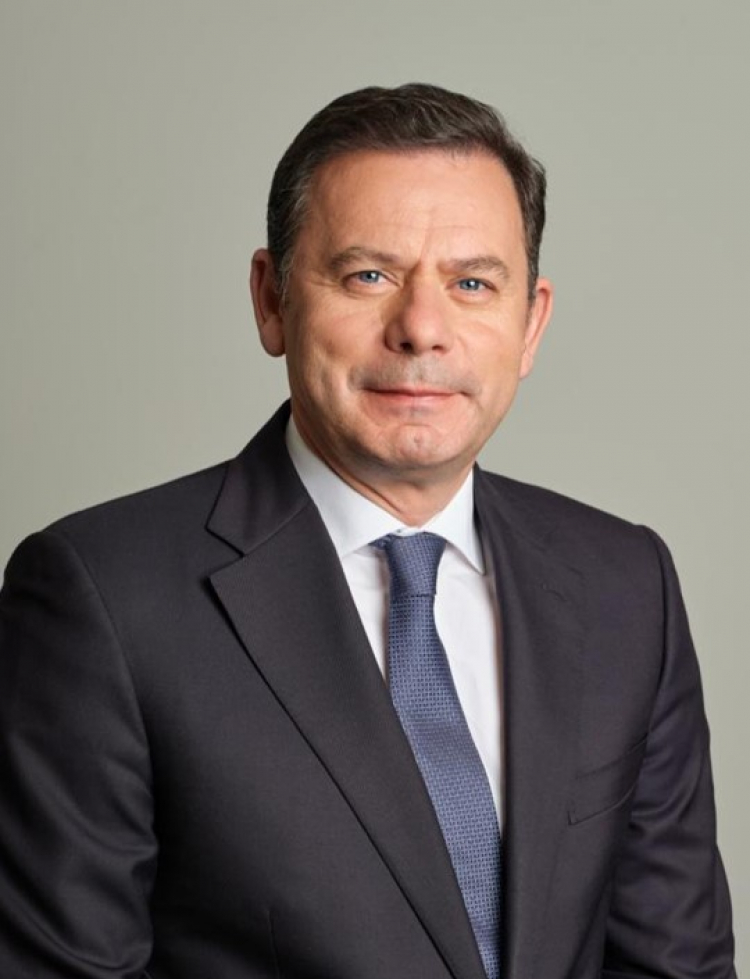
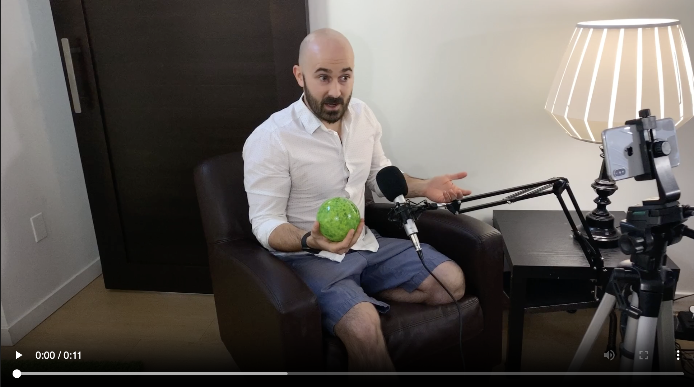
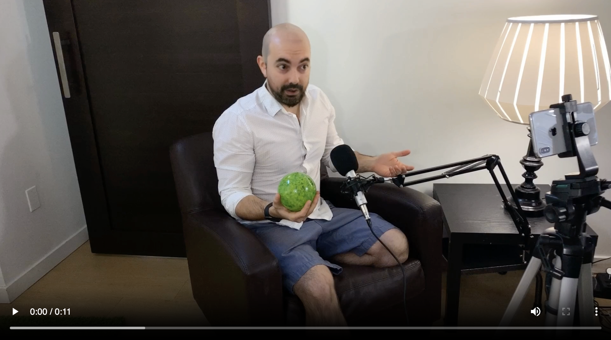

AI Engineer Academy
====================

## Projeto: VCD/facefusion

Este projeto utiliza o FaceFusion (versão Docker em `VCD/facefusion`) para realizar face swap em imagem e vídeo.

### Origens
- Imagem alvo: `.faces/target/LM.jpg`
- Vídeo alvo: `.faces/target/hd-movie.mp4`

### Resultados
- Imagem resultante: `.faces/output_images/LM_swap.jpg`
- Vídeo resultante: `.faces/output_videos/hd-movie_swap.mp4`

### Visualização no GitHub

#### Imagem alvo

#### Imagem resultante (face swap)

#### Vídeo alvo

#### Vídeo resultante (face swap)

